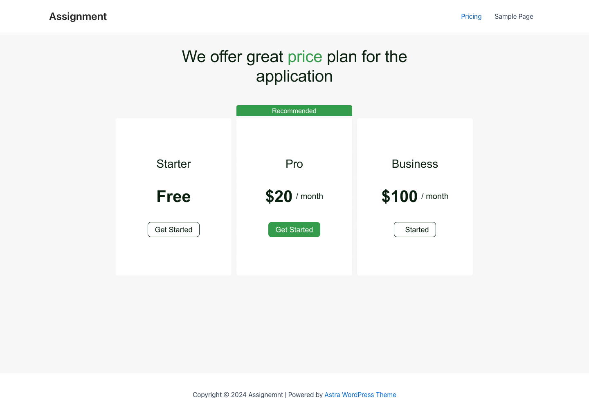

# iTrinity WordPress Interview Instructions

Welcome to the iTrinity WordPress interview. This README will guide you on how to set up and run the WordPress instance required for the interview.

## Prerequisites

- Docker installed on your machine
- Git installed on your machine

## Getting Started

### 1. Clone the Repository

First, you need to clone the GitHub repository containing the WordPress project. Open your terminal and run the following command:

```bash
git clone https://github.com/subalee/wp-assignment.git
```

### 2. Start the project

The repository includes a docker-compose file so that you don't have to deal with the setup yourself. However if you are not familiar with docker feel free to run the project using whatever you prefer.

```
docker-compose up -d
```

### 3. Accessing the project

If using docker, the project can be found here:

```
http://localhost:8080
```

### 4. Install WordPress and use the Astra theme provided

Go trough the initial wordpress setup. The Astra theme is already included

## Your Task

You will be creating a simple pricing page. The goal is not to complete everything within the live coding session. It's the process that counts!

### The Design

Below is a simple design we are going to be implementing. We will create a simple pricing page where we will list pricing plans.
The pricing plans will be created as wordpress posts.

The user who is creating the plan posts can input the price and choose whether the plan is "recommended". A recommended plan is highlighted as can be seen in the design



### Checklist

[] Setup your local dev environment
[] Figure out a way for users to add plans with prices and the option to mark the plan as recommended
[] Implement the design
[] Add the plans and list them on a pricing page
[] Discuss

Good luck!
